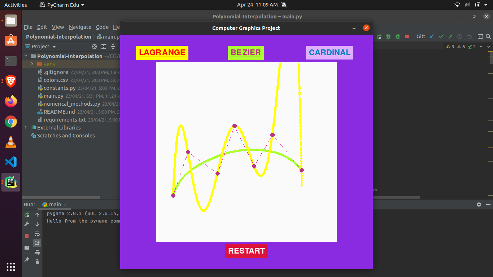

# Polynomial Approximation
Lagrange Interpolation, Bezier Spline, Cardinal Spline for Computer Graphics Project

To the Layman: Draws Curves Connecting Points

For more information, view the [PPT](https://drive.google.com/file/d/1LRz3J5BvzcarbiMoxut9mob0YJA42bVl/view?usp=sharing).

## [Demonstration Video](https://drive.google.com/file/d/1iXWsMlv_aQoM_pfPLC17QLTZ9irUa487/preview)

## Screenshots




## How to Run

Developed with Python 3.8.

Install depedencies (Pygame, Numpy, Pandas) using pip.

```bash
pip install -r requirements.txt
```

Run with 

```bash
python main.py
```

## Contributors

- [Arun Kumar](https://github.com/arunkumaraqm)
- [Ananth Desai](https://github.com/AnanthDesai)

## License
[MIT License](LICENSE)